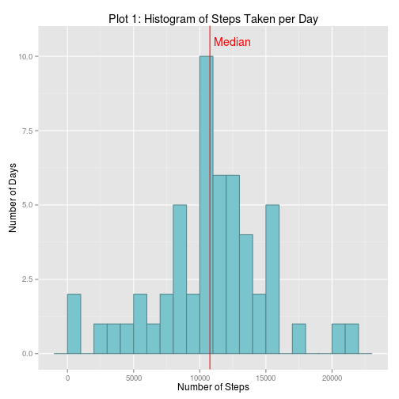
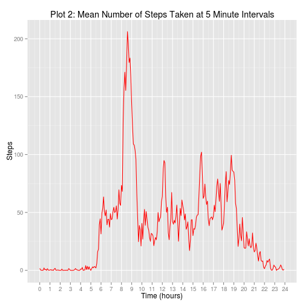
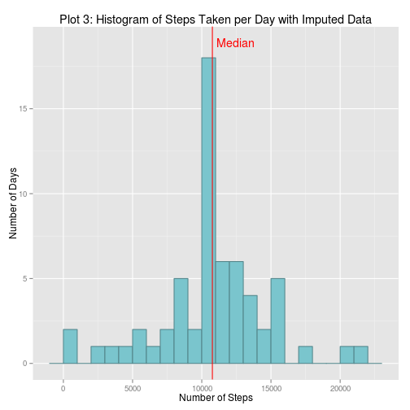
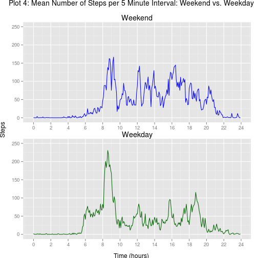

# Reproducible Research: Peer Assessment 1

Alter knitr options for output control:

```r
# prevent default numeric output in scientific notation
options(scipen = 1, digits = 2) 
```

Ensure necessary libraries are available and loaded:

```r
require("ggplot2") || install.packages("ggplot2")
```

```
## Loading required package: ggplot2
```

```
## [1] TRUE
```

```r
require("gridExtra") || install.packages("gridExtra")
```

```
## Loading required package: gridExtra
## Loading required package: grid
```

```
## [1] TRUE
```


## Loading and preprocessing the data

Unzip the data file from the activity.zip file included in the forked repository:

```r
unzip("activity.zip")
```
Read activity data to memory, convert date string to date type and check the data frame looks correct:

```r
df <- read.csv("activity.csv", 
               header=TRUE, 
               colClasses=c("numeric", "character", "numeric"))
df[, "date"] <- as.Date(df[, "date"], format="%Y-%m-%d")
summary(df)
```

```
##      steps           date               interval   
##  Min.   :  0    Min.   :2012-10-01   Min.   :   0  
##  1st Qu.:  0    1st Qu.:2012-10-16   1st Qu.: 589  
##  Median :  0    Median :2012-10-31   Median :1178  
##  Mean   : 37    Mean   :2012-10-31   Mean   :1178  
##  3rd Qu.: 12    3rd Qu.:2012-11-15   3rd Qu.:1766  
##  Max.   :806    Max.   :2012-11-30   Max.   :2355  
##  NA's   :2304
```

```r
head(df)
```

```
##   steps       date interval
## 1    NA 2012-10-01        0
## 2    NA 2012-10-01        5
## 3    NA 2012-10-01       10
## 4    NA 2012-10-01       15
## 5    NA 2012-10-01       20
## 6    NA 2012-10-01       25
```


## What is mean total number of steps taken per day?

Calculate sum of steps per day, ignoring any missing values. Then from this 
new data frame calculate the mean and median steps per day.

```r
stepsPerDay <- aggregate(steps~date, df, na.rm=TRUE, FUN=sum)
meanStepsPerDay <- mean(stepsPerDay$steps)
medianStepsPerDay <- median(stepsPerDay$steps)
```

Plot and display a histogram of the total steps per day:

```r
plot1 <- (ggplot(stepsPerDay, aes(x=steps)) 
        + geom_histogram(colour="cadetblue4", 
                fill="cadetblue3", 
                binwidth=1000) 
        + labs(title="Plot 1: Histogram of Steps Taken per Day", 
                x="Number of Steps", 
                y="Number of Days")
        )
## add median line to the plot
## the annotate command examines the calculated range in the plot to
## dynamically determine where to place the text label - it ensures it
## always appears above the highest peak in the histogram
plot1 <- (plot1 + geom_vline(aes(xintercept=meanStepsPerDay), 
                        colour="red")
                + annotate("text", 
                        x=meanStepsPerDay, 
                        y=ggplot_build(plot1)$panel$ranges[[1]]$y.range[2],
                        vjust=0.5,
                        hjust=-0.1,
                        label="Median", 
                        colour="red"))
print(plot1)
```

 
### What are the mean and median number of steps?

The **mean** number of steps taken each day is: 10766.19  
The **median** number of steps taken each day is: 10765


## What is the average daily activity pattern?

Begin by calculating the mean number of steps per each 5 minute interval, averaged over all days (ignoring missing values):

```r
stepsPerInt <- aggregate(steps~interval, df, na.rm=TRUE, FUN=mean)
```
To aid the plotting of a time series chart, convert the interval notation into a decimal number representing hours. For example the interval "30" corresponds to 0.5 hours, 245 would be 2.75 hours, etc.

```r
stepsPerInt$time <- (as.numeric(substr(sprintf("%04d", stepsPerInt$interval), 1, 2)) 
                     + as.numeric(substr(sprintf("%04d", stepsPerInt$interval), 3, 4))/60)
```
Now create and display the time series plot of average steps per interval:

```r
plot2 <- (ggplot(stepsPerInt, aes(x=time, y=steps)) 
        + geom_line(color="red")
        + labs(title="Plot 2: Mean Number of Steps Taken at 5 Minute Intervals", 
               x="Time (hours)", 
               y="Steps")
        + scale_x_continuous(breaks=c(seq(0, 24, by=1)))
        )
print(plot2)
```

 

The chart clearly shows a large burst of activity between 8 and 9am. I would hazard a guess that this is the time people are getting ready and travelling to work or school. 

```r
maxInt <- stepsPerInt[stepsPerInt$steps==max(stepsPerInt$steps),]
interval <- sprintf('%g:%g', floor(maxInt$time), (maxInt$time-floor(maxInt$time))*60)
```
The interval with the mean maximum number of steps is the 5 minutes leading up to 8:35. The mean number of steps during that 5 minute period is 206.17.


## Imputing missing values

Calculate the number of missing values by subtracting the number of rows that include an NA from the total number of rows.

```r
numberNA <- nrow(df) - nrow(df[complete.cases(df), ])
```
The data frame contains 2304 rows with missing values. Furthermore, only the steps column contains missing values - the date and interval columns are complete.

The strategy I will use to impute the missing values is straightforward: create a copy of the data frame and for each missing step count, replace it with the mean step count for that interval across all days from the existing data.

```r
df2 <- df
for (i in 1:nrow(df2)) {
        if (is.na(df2[i, "steps"])) {
                df2[i, "steps"] <- mean(df[df$interval==df[i, "interval"], "steps"], na.rm=TRUE)
        }
}
```
Now we can create a version of Plot 1 above, but using the new data frame containing imputed values. We can also calculate new mean and median number of steps per day based on this new data frame:

```r
stepsPerDayImputed <- aggregate(steps~date, df2, na.rm=TRUE, FUN=sum)
meanStepsPerDayImputed <- mean(stepsPerDayImputed$steps)
medianStepsPerDayImputed <- median(stepsPerDayImputed$steps)
plot3 <- (ggplot(stepsPerDayImputed, aes(x=steps)) 
          + geom_histogram(colour="cadetblue4", 
                fill="cadetblue3", 
                binwidth=1000)
          + labs(title="Plot 3: Histogram of Steps Taken per Day with Imputed Data", 
                x="Number of Steps", 
                y="Number of Days")
)
## add median line to the plot
## the annotate command examines the calculated range in the plot to
## dynamically determine where to place the text label - it ensures it
## always appears above the highest peak in the histogram
plot3 <- (plot3 + geom_vline(aes(xintercept=meanStepsPerDayImputed), 
                        colour="red")
                + annotate("text", 
                        x=meanStepsPerDayImputed, 
                        y=ggplot_build(plot3)$panel$ranges[[1]]$y.range[2],
                        vjust=0.5,
                        hjust=-0.1,
                        label="Median", 
                        colour="red"))
print(plot3)
```

 

Visual comparison of Plots 1 and 3 show a very similar pattern with the only obvious difference being the frequency (number of days) being approximately 50% larger on the chart with imputed values. This would imply that the missing values were approximately evenly spread across all intervals. This is further backed up by identical **mean** of 10766.19 and **median** of 10766.19 (a difference of only 1.19 steps).


## Are there differences in activity patterns between weekdays and weekends?

Continuing to use our data frame with imputed values, we add a factor column to distinguish between "weekdays" and "weekends".

```r
df2$weekdayOrWeekend <- ifelse(weekdays(df2$date) %in% c("Saturday", "Sunday"), "weekend", "weekday")
```
We can now repeat the steps from Plot 2 above, to create a time series chart, but now we can differentiate between weekday and weekend activity patterns. We begin by creating data frames containing the mean number of steps per interval, and then adding a ecimal representation of the interval:

```r
stepsPerIntWeekday <- aggregate(steps~interval, df2[df2$weekdayOrWeekend=="weekday", ], na.rm=TRUE, FUN=mean)
stepsPerIntWeekend <- aggregate(steps~interval, df2[df2$weekdayOrWeekend=="weekend", ], na.rm=TRUE, FUN=mean)

stepsPerIntWeekday$time <- (as.numeric(substr(sprintf("%04d", stepsPerIntWeekday$interval), 1, 2)) 
                            + as.numeric(substr(sprintf("%04d", stepsPerIntWeekday$interval), 3, 4))/60)
stepsPerIntWeekend$time <- (as.numeric(substr(sprintf("%04d", stepsPerIntWeekend$interval), 1, 2)) 
                            + as.numeric(substr(sprintf("%04d", stepsPerIntWeekend$interval), 3, 4))/60)
```
Each time series plot will be generated separately, but for easy comparison we will set both plots to have the same y-axis scale. To do this we need to determine the maximum y-value in the two plots and round to nearest 50:

```r
maxY.weekday <- max(stepsPerIntWeekday$steps)
maxY.weekend <- max(stepsPerIntWeekend$steps)
maxY <- ifelse(maxY.weekday > maxY.weekend, maxY.weekday, maxY.weekend)
maxY <- round(maxY/50)*50
```
Now we will plot the two charts and display them together using the grid.arrange function in the gridExtras library:

```r
plot4a <- (ggplot(stepsPerIntWeekend, aes(x=time, y=steps)) 
          + geom_line(color="blue")
          + labs(title="Weekend",
                x=NULL,
                y=NULL)
          + scale_x_continuous(breaks=c(seq(0, 24, by=2)))
          + ylim(0, maxY)
          + theme(plot.margin=unit(c(5, 5, 0, 5), "mm"))
)

plot4b <- (ggplot(stepsPerIntWeekday, aes(x=time, y=steps)) 
          + geom_line(color="darkgreen")
          + labs(title="Weekday",
                x=NULL,
                y=NULL)
          + scale_x_continuous(breaks=c(seq(0, 24, by=2)))
          + ylim(0, maxY)
          + theme(plot.margin=unit(c(0, 5, 5, 5), "mm"))
)

grid.arrange(plot4a, 
             plot4b, 
             nrow=2, 
             left="Steps",
             sub="Time (hours)",
             main=textGrob("Plot 4: Mean Number of Steps per 5 Minute Interval: Weekend vs. Weekday", gp=gpar(fontsize=14)))
```

 

The difference in activity levels are noticeable between weedays and weekends. Activity starts to speed up earlier in the day during the week - no surprise there: many people enjoy the luxury of a "lie in" on the weekend. The spike of activity between 8 and 9am is not as pronounced on the weekend, but it is the most active period during the day.

On weekdays, the activity after 9am drops significantly and remains below 100 steps for tha majority of the rest of the day. Activity noticeably starts to trail off after 8pm. Weekends show a different pattern of activity: activity levels remain relatively high, with several noticeable peaks throughout the day. Activity is also higher later in the day, with the noticeable slow-down occurring later in the evening.
